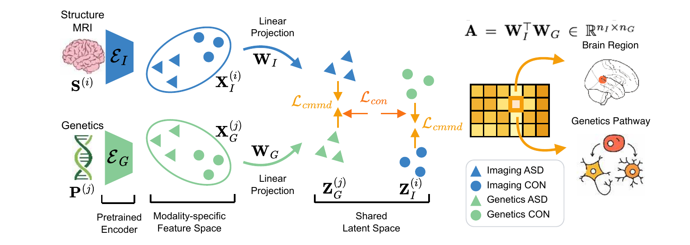
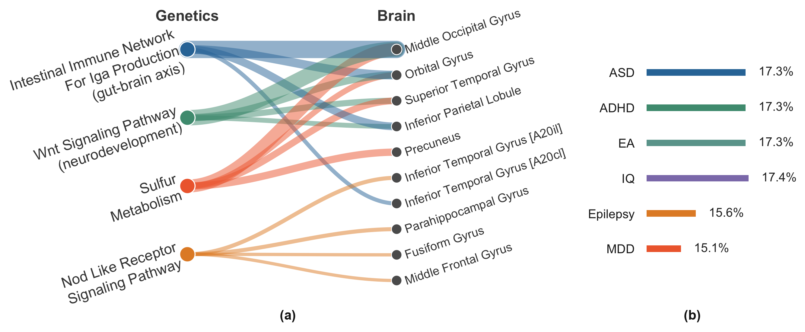

<div align="center">

## CALM: Interpretable Cross-Modal Alignment for Biomarker Discovery from Unpaired Data


[](https://arxiv.org/pdf/2607.01656)
</div>

## Overview
<p align="center">
  
</p>

CALM discovers interpretable ROI–pathway associations from completely **unpaired** data. Linear transforms map imaging and genetics from disjoint cohorts into a shared latent space, aligned by matching their class-conditional distributions.

## Getting Started

```bash
pip install torch numpy pandas scikit-learn monai nibabel nilearn matplotlib seaborn scipy
```

Dataset paths are cluster-specific placeholders. Point them to your own data first:
- Dataset / checkpoint roots → `code/utils/const.py`
- Stage-1 output and checkpoint paths → `STAGE1_OUT` / `*_CKPT_TMPL` in `job_scripts/`

Then run the two-stage procedure in order:

```bash
# Stage 1 — pretrain the encoders
bash job_scripts/stage1_imaging.sh
bash job_scripts/stage1_genetics.sh

# Stage 2 — train the linear projections (alignment)
bash job_scripts/stage2_alignment.sh
```

## Method
<p align="center">
  
</p>

Alignment is driven by two losses. A **class-conditional MMD** (`L_cmmd`) matches the imaging and genetics latent distributions *within each diagnostic group*, aligning the modalities without paired samples. A **supervised contrastive** loss (`L_con`) then pulls same-class samples together across modalities and pushes different classes apart, keeping the diagnostic groups separable — with an orthogonality regularizer (`L_orth`) preventing degenerate projections.

## Imaging-Genetics Associations
<p align="center">
  
</p>

## Citation
If any of the results in this paper or code are useful for your research, please cite the corresponding paper:

```
@inproceedings{wang2026calm,
  title={CALM: Interpretable Cross-Modal Alignment for Biomarker Discovery from Unpaired Data},
  author={Wang, Jueqi and Jacokes, Zachary and Van Horn, John Darrell and Pelphrey, Kevin A. and Schatz, Michael C. and Venkataraman, Archana},
  booktitle={Medical Image Computing and Computer-Assisted Intervention -- MICCAI 2026},
  year={2026},
  publisher={Springer}
}
```
