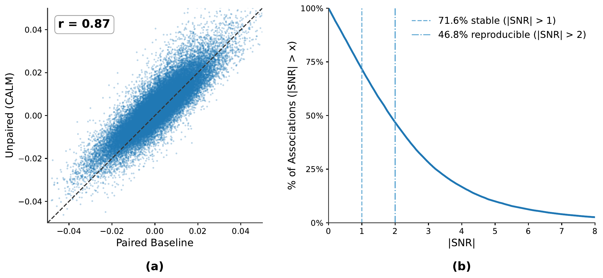

<div align="center">

## CALM: Interpretable Cross-Modal Alignment for Biomarker Discovery from Unpaired Data


[](https://arxiv.org/pdf/2607.01656)
</div>

## Overview
<p align="center">
  
</p>

## Getting Started

### Environment

```bash
pip install torch numpy pandas scikit-learn monai nibabel nilearn matplotlib seaborn scipy
```

### Running on real data — paths to change

All dataset paths are cluster-specific placeholders. **Point them to your own data before a real
run:**

| What | Where to edit |
|---|---|
| All dataset/checkpoint roots (ABIDE/ACE/SSC CSVs, FreeSurfer dirs, TensorBoard, results) | `code/utils/const.py` |
| SSC + ACE genetics CSVs | `load_genetics_data()` in `code/main.py` |
| Stage-1 imaging checkpoint output dir | `STAGE1_OUT` in `job_scripts/stage1_imaging.sh` |
| Pretrained Stage-1 checkpoints (`--pretrained_imaging_checkpoint`, `--pretrained_genetics_checkpoint`) | `IMG_CKPT_TMPL` / `GEN_CKPT_TMPL` in `job_scripts/stage2_alignment.sh` (currently `/path/to/...`) |

Expected on-disk format:
- **Imaging:** per-subject Brainnetome ROI features as a flat `n_ROI × 4` vector (ROI-major),
  loaded by `get_ABIDE_I_subject` / `get_ABIDE_II_subject` / `get_ACE_subjects` into each
  sample's `image_features`. (If your CSV is feature-major, flip the reshape in
  `_ROIFeatureDataset` in `main.py`.)
- **Genetics:** pathway tensors via `PathwayDataset` (177 pathways × 6 GWAS traits).

### Full 5-fold run (paper hyperparameters, two stages)

The complete two-stage procedure (Sec. 2.4) is provided as ready-to-run scripts in
`job_scripts/` — encoders + classifiers are pretrained first (`stage1_imaging.sh`,
`stage1_genetics.sh`), then the linear projections are trained (`stage2_alignment.sh`) with the
paper hyperparameters. Set the output/checkpoint paths at the top of each script, then run them
in order.

### Repo layout

- `code/main.py` — CALM alignment training (the entry point).
- `code/models/` — `genetics_encoder.py` (per-entity `PathwayEncoder`, reused as the
  per-ROI imaging encoder `E_I`), `alignment_model.py` (`SharedLatentProjector`), `losses.py`.
- `code/train_stage1.py` — Stage-1 encoder pretraining; pick the modality with
  `--modality {imaging,genetics}` (per-ROI imaging `E_I` or per-pathway genetics `E_G`).
- `code/utils/` — `const.py` (paths), `add_argument.py` (CLI flags), `utils.py` (loaders).
- `job_scripts/` — `stage1_imaging.sh`, `stage1_genetics.sh`, `stage2_alignment.sh` (5-fold launchers).

## Method
<p align="center">
  
</p>

## Imaging-Genetics Associations
<p align="center">
  
</p>

## Results
<p align="center">
  
</p>

## Citation
If any of the results in this paper or code are useful for your research, please cite the corresponding paper:

```
@inproceedings{wang2026calm,
  title={CALM: Interpretable Cross-Modal Alignment for Biomarker Discovery from Unpaired Data},
  author={Wang, Jueqi and Jacokes, Zachary and Van Horn, John Darrell and Pelphrey, Kevin A. and Schatz, Michael C. and Venkataraman, Archana},
  booktitle={Medical Image Computing and Computer-Assisted Intervention -- MICCAI 2026},
  year={2026},
  publisher={Springer}
}
```
